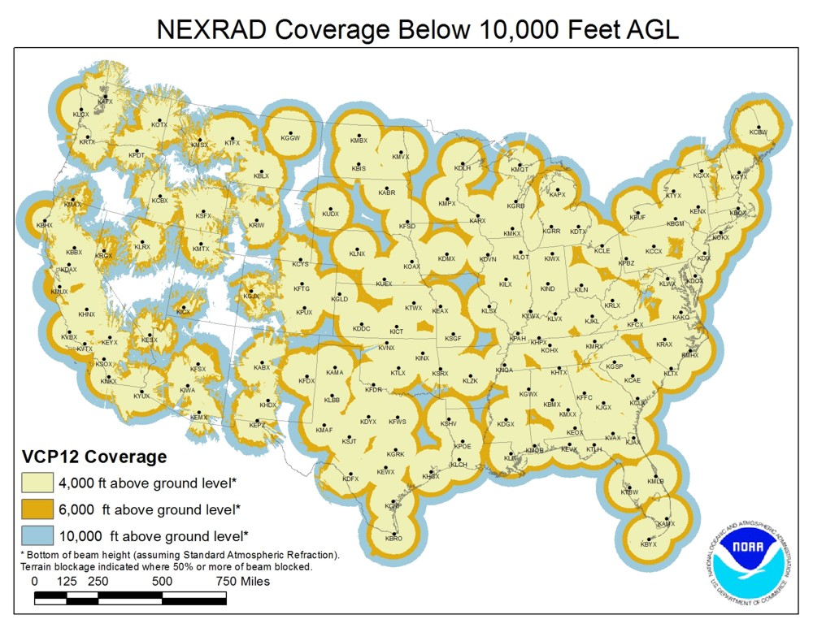

py-radar
========

Resource for grabbing radar images... Right now just from NOAA.

* Radar sites - Just remove the 'k' in front of each site in the image below.  For example, 'KHTX' becomes 'HTX'.

